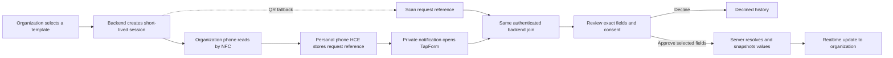
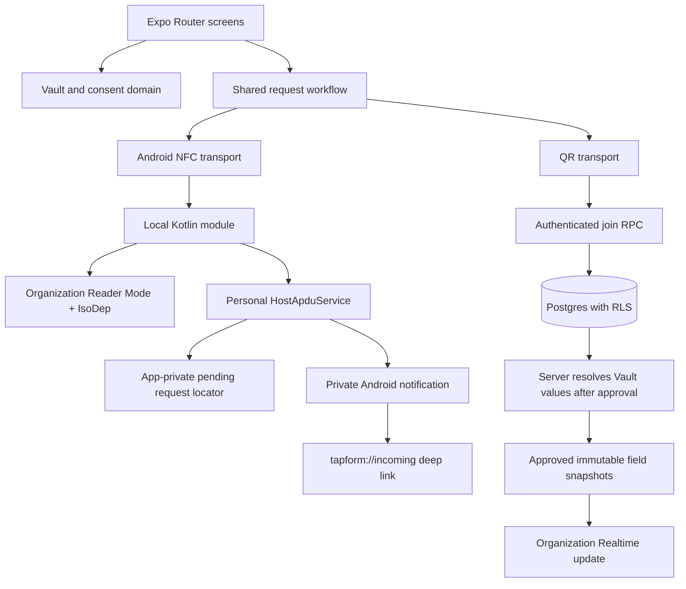

# TapForm

TapForm replaces repetitive forms with a private structured Vault and explicit, field-by-field sharing. An organization requests only the information needed for its stated purpose. A person reviews the requester, purpose, required and optional fields, and retention before approving or declining.

**Brand promise:** Your information. Your control.

## Product flow



NFC and QR carry request context only: protocol version, session UUID, nonce, expiry, and organization UUID. No Vault value crosses NFC or QR. Both transports converge on the same authenticated session join and server-side consent workflow.

## Architecture

- Expo SDK 57, React Native 0.86, TypeScript, Expo Router
- Local Kotlin Expo module using Android Reader Mode, `IsoDep`, and `HostApduService`
- Supabase Auth, Postgres, RLS, server-side RPCs, and Realtime
- Expo SecureStore for persisted Supabase auth tokens
- Expo Camera for the QR fallback
- Reanimated, SVG, Skia, Expo Haptics for restrained monochrome interactions



The organization has no direct policy to read `personal_fields`. Authenticated RPCs validate session state, expiry, requested keys, required keys, and user ownership. The server resolves personal values and writes only explicitly approved snapshots. Review [DESIGN.md](DESIGN.md), [MOTION.md](MOTION.md), and [ASSETS.md](ASSETS.md) for product foundations.

## Setup

Requirements: Node.js 22.13+, JDK 17, Android SDK Platform 36 and Build Tools, Android platform tools, and Supabase CLI when running database tasks.

```sh
npm install
Copy-Item .env.example .env
npx expo prebuild --platform android
npm run android
```

Set `EXPO_PUBLIC_SUPABASE_URL` and `EXPO_PUBLIC_SUPABASE_ANON_KEY` in `.env`. The client must only use Supabase's public anon/publishable key. Never put the service-role key in an Expo environment variable or client build. Keep `EXPO_PUBLIC_DEMO_MODE=false` outside isolated development builds.

For local Supabase:

```sh
supabase start
supabase db reset
```

For an already configured hosted project:

```sh
supabase link --project-ref <project-ref>
supabase db push
```

Migrations define normalized Vault fields, organizations and memberships, templates, sessions, responses, approved values, constraints, RLS, approval/join RPCs, and retention cleanup. The fictional demo seed is deliberately separate from production migrations and should only be installed in an isolated demo project. Hosted credentials and project setup are operator-provided.

## Android NFC architecture

**Target roles are organization = NFC Reader / initiator and personal = HCE / passive receiver.** Android documents HCE through `HostApduService` and ISO-DEP, with a service capable of handling APDUs while the app Activity is not foregrounded. The user is notified and must open TapForm to join through the backend and review consent. Screen-off, lock-screen, Secure NFC, and OEM-specific behavior still require device validation.

The organization screen creates a session through Supabase and enables foreground Reader Mode. It sends `SELECT AID`, then a versioned `SEND_REQUEST` envelope to the personal HCE service. HCE validates the fixed-length packet and expiry, persists a short-lived pending locator in app-private storage, posts a privacy-redacted notification, and acknowledges delivery. The pending notification carries only a random local pending ID. Tapping it opens `tapform://incoming?pendingId=…`; authenticated JavaScript retrieves the pending locator and calls the same `join_request_session` RPC used by QR. No consent or personal values are transmitted in the APDU exchange.

APDU v2 uses AID `F04E464354415001`, a version byte, an 8-byte expiry, session UUID, 16-byte nonce, and organization UUID (57 bytes total). Invalid headers, versions, lengths, UUIDs, or expired requests are rejected. Repeated pending requests are acknowledged without duplicate notifications; consumed/replayed sessions are rejected locally when remembered and authoritatively by the backend in all cases. One active pending request is kept per device. Native debug logs contain only event names and coarse error categories.

Physical NFC between two phones has **not** been verified. The Kotlin protocol unit test and Android compilation are the structural checks. Later manual test: install the same build on two NFC Android phones, enable NFC, sign in as organization on one and personal on the other, start a request, tap their NFC antenna areas, open the notification, confirm organization/purpose/fields, then decline and approve separate new requests. Repeat after expiry/replay; inspect that the organization receives only approved fields. Samsung and other OEM lock-screen behavior and antenna placement vary.

## Notifications and links

The native service creates an Android `Information requests` notification channel and uses private lock-screen visibility. Notification copy contains no Vault data and no organization/session secrets: “Information request” / “Unlock to review.” The app resolves authenticated request details only after the user opens the app. Notification permission can be granted later in Profile. Pending request context expires with the server session. Sign-in preserves the local pending ID and resumes the incoming request screen.

The review screen remains the only route to approval. There is no one-tap notification approval. This preserves optional-field choice and the full consent display. Pending-reference persistence is app-private Android storage; backend authorization and replay protection remain authoritative.

## QR fallback

The organization can display a QR for the same expiring session. It contains only the request locator and nonce. The personal phone scans through Expo Camera, validates the packet, and joins through the exact same backend path used by NFC. Camera permission is requested on the scan screen, with a clear explanation and denial state. Invalid, expired, or already-used sessions are rejected. QR scanning is a transport only, not a separate business flow.

## Security and retention

- RLS protects user Vault rows and organization-owned data. Organization membership scopes templates, sessions, and submissions.
- Organizations cannot directly query another person's Vault. Approved values are exposed only through immutable response snapshots.
- The server checks authentication, session organization, expiry, status, requested keys, required keys, and field ownership before writing a response.
- A session ID alone is not authorization; the nonce/session state is validated and consumed on the server.
- Optional fields excluded by the person are not resolved into the approved snapshot.
- Auth tokens use SecureStore. Avoid logging values, tokens, nonces, or sensitive notification content.
- Organization status is not presented as verified unless an actual verification process exists.
- Approved value snapshots have retention metadata and a purge function. Schedule `purge-expired-shares` in the hosted Supabase project according to its deployment guide; the function retains audit rows while removing expired copied values.

No legal, regulatory, or identity-verification certification is claimed. See [Privacy Policy Draft](docs/PRIVACY_POLICY_DRAFT.md) and the release checklist before publication.

## Demo

Use two separate authenticated accounts in an isolated Supabase project. The organization account owns the fictional Northfield Tech Fest/Event Registration template; the personal account owns fictional Alex Morgan Vault values. Set up demo data only through the explicit demo seed RPC in development. Start Event Registration, use NFC or “Show QR code instead,” review the exact requested fields on the personal device, switch off optional phone, and approve. The organization should receive a Realtime update containing only approved values; personal Activity and organization Submissions retain the appropriate history. A fresh request can be created for each run. Never reuse previously exposed demo passwords.

## Development and verification

```sh
npm run typecheck
npm run lint
npm test
npx expo install --check
npx expo-doctor
cd android
./gradlew :tapform-nfc-peer:testDebugUnitTest assembleDebug
```

On Windows, use `gradlew.bat`. The NFC diagnostic and preview routes are development-only. `nfc-test` can inspect the organization Reader side or the personal pending-HCE reference without sending Vault data. Physical two-phone testing remains a required hardware check; a successful build does not establish NFC interoperability.

## Limitations and future work

- Android-to-Android NFC is the target. Physical interoperability, screen-off/locked states, Secure NFC, and OEM behavior have not been validated on two phones.
- A pending HCE request is held app-privately and expires shortly. The backend remains authoritative if native state or notifications are unavailable.
- Account deletion, organization verification, invitations, and a complete legal/privacy publication package require additional production work; see `docs/RELEASE_CHECKLIST.md`.
- iOS peer-to-peer NFC/HCE is not implemented or claimed. QR remains the cross-platform fallback; future BLE/deep-link transports can retain the same backend consent pipeline.
- Selective-disclosure credentials and identity verification are future work.
